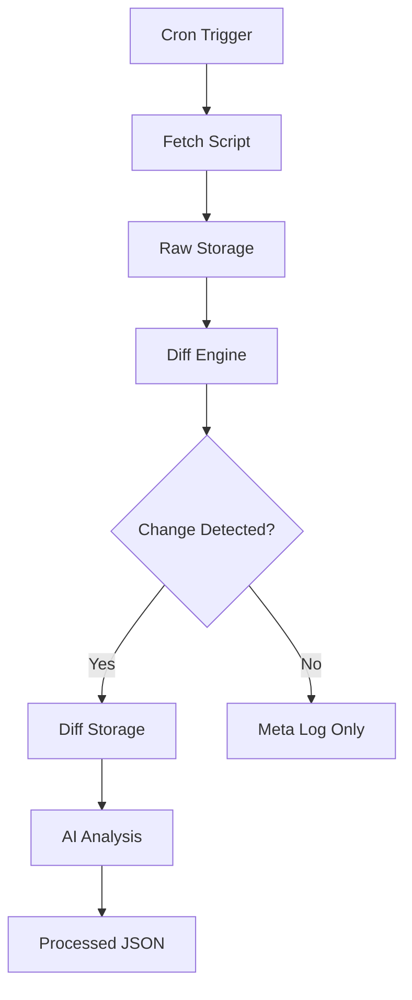

# RULE — Regulation Update & Logging Engine

## Overview

RULE is an automated system that tracks and records changes in policy documents over time.
It captures daily snapshots, detects differences, and stores structured outputs for analysis.

---

## Architecture



---

## Directory Structure

```
rule/
├── data/
│   └── google/
│       └── privacy_policy/
│           ├── raw/         # Raw text snapshots
│           ├── diff/        # Line-by-line differences
│           ├── processed/   # AI-analyzed structured output
│           └── meta/        # Change detection logs
│
├── scripts/
│   ├── fetch.py            # Fetch latest document
│   ├── diff.py             # Compare versions
│   ├── analyze.py          # AI-based interpretation
│   └── utils.py            # Shared utilities
│
├── .github/workflows/
│   └── rule.yml            # Automation pipeline
│
├── requirements.txt
└── README.md
```

---

## Data Layers

### Raw

* Plain text snapshot of document
* Stored only when changes occur

### Diff

* Unified diff between versions
* Captures additions and removals

### Processed

* Structured JSON output
* Includes summary, classification, and impact

### Meta

* Daily log of change detection
* Contains hash and change status

---

## Workflow

1. Fetch latest document
2. Normalize and store text
3. Generate hash
4. Compare with previous version
5. If changed:

   * Generate diff
   * Run analysis
   * Store structured output
6. If unchanged:

   * Log metadata only

---

## Scheduling

* Runs automatically via GitHub Actions
* Default: once per day

---

## Output Format

Example:

```json
{
  "date": "YYYY-MM-DD",
  "entity": "Company",
  "document": "policy_type",
  "summary": "...",
  "change_type": "...",
  "risk_level": "...",
  "topics": [],
  "user_impact": "..."
}
```

---

## Design Principles

* Deterministic change detection
* Minimal storage footprint
* Structured, queryable data
* Automation-first architecture

---

## Extensibility

* Add more companies under `data/`
* Add more document types per entity
* Replace or upgrade AI analysis layer
* Integrate alerting or dashboards

---

## License

For research and monitoring purposes.
