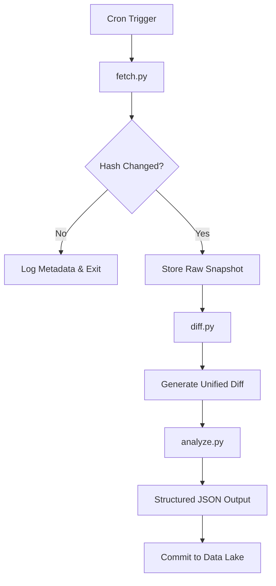

# RULE: Regulation Update & Logging Engine

## Overview

RULE is a fully automated, serverless data engineering pipeline designed to monitor, extract, and permanently archive changes in corporate policy documents. By utilizing deterministic hashing and unified diff generation, RULE tracks "stealth edits" to legal frameworks, Terms of Service, and Privacy Policies. 

This repository serves as a permanent, immutable ledger of corporate policy evolution, executing silently via scheduled continuous integration workflows.

## System Architecture

The pipeline is built on a flat-data architecture, eliminating the need for expensive external databases by utilizing the repository's file system as a time-series data lake.



## Long-Term Vision and Value Extraction

The internet is largely ephemeral; companies frequently update their terms without providing historical archives. RULE solves this by creating a proprietary, highly valuable dataset over time. 

Using **Google LLC** as a primary tracking target (specifically the Google Privacy Policy), the long-term utility of this project includes:

1.  **Historical Compliance Auditing:** Over a 1 to 3-year period, RULE builds a minute-by-minute ledger of how Google LLC alters its data collection frameworks. This allows analysts to pinpoint the exact date a specific data-sharing clause was introduced or removed.
2.  **Enterprise Risk Feeds:** Legal teams and compliance officers require real-time alerts when mega-corporations change their rules. The structured JSON outputs generated by RULE can be served via API as a premium B2B risk-intelligence feed.
3.  **Accountability and Research:** Journalists and policy researchers lack tools to perform computational analysis on legal text changes. By converting raw HTML updates into structured, line-by-line diffs, RULE provides the mathematical proof required to track corporate overreach or policy shifting.

## Directory Structure

```text
rule/
├── data/
│   └── google/
│       └── privacy_policy/
│           ├── raw/         # Full text snapshots of the document
│           ├── diff/        # Line-by-line additions and removals
│           ├── processed/   # Structured JSON analysis of the changes
│           └── meta/        # Checksums and change-detection logs
├── scripts/
│   ├── fetch.py             # Ingestion and hash verification
│   ├── diff.py              # Unified diff generation
│   ├── analyze.py           # Structuring and classification 
│   └── utils.py             # Shared I/O and hashing functions
└── .github/workflows/
    └── rule.yml             # GitHub Actions automation pipeline
```

## Core Components

### 1. Ingestion Engine (`scripts/fetch.py`)
This script is responsible for the initial data extraction. It downloads the target policy, strips away volatile HTML formatting, and generates a SHA-256 hash of the pure text. If the hash matches the previous day's record, the script halts to conserve compute resources.

```python
# snippet: hash verification logic
current_hash = generate_hash(current_text)
last_hash = load_text(meta_file)

if current_hash == last_hash:
    print("No changes detected. Exiting cleanly.")
    sys.exit(0) 

print("Change detected! Saving new raw snapshot...")
save_text(raw_path, current_text)
```

### 2. Difference Engine (`scripts/diff.py`)
When a change is detected, this script isolates the exact modifications. It compares the newly downloaded text against the most recent historical snapshot using Python's built-in comparison libraries, generating a standard unified diff file.

```python
# snippet: generating the unified diff
diff = difflib.unified_diff(
    old_text, new_text, 
    fromfile="previous_version.txt", 
    tofile="current_version.txt", 
    lineterm=''
)
diff_text = '\n'.join(list(diff))
```

### 3. Structuring Layer (`scripts/analyze.py`)
Raw diffs are difficult to query programmatically. This script parses the generated `.diff` file and wraps the findings into a clean, structured JSON format. This step ensures the data is ready for downstream consumption, dashboards, or API delivery.

```python
# snippet: structured JSON output format
snapshot = {
    "date": "2026-04-27",
    "entity": "Google LLC",
    "document": "Privacy Policy",
    "change_detected": True,
    "additions": extract_additions(diff_data),
    "removals": extract_removals(diff_data)
}
```

### 4. Shared Utilities (`scripts/utils.py`)
A helper file containing reusable functions for directory management, safe file reading/writing, and cryptographic hashing to ensure the pipeline remains DRY (Don't Repeat Yourself).

### 5. Automation Pipeline (`.github/workflows/rule.yml`)
The engine that drives the entire system. Configured to run automatically via cron schedule, it provisions a serverless Ubuntu environment, executes the Python scripts, and commits any new data directly back to the repository.

```yaml
# snippet: workflow scheduling and execution
on:
  schedule:
    - cron: '0 0 * * *' 

jobs:
  monitor:
    runs-on: ubuntu-latest
    steps:
      - run: python scripts/fetch.py
      - run: python scripts/diff.py
```

## Deployment

1. Fork this repository.
2. Ensure GitHub Actions are enabled in the repository settings.
3. The pipeline will automatically execute daily at midnight UTC.
4. To trigger a manual sweep, navigate to the Actions tab and select "Run workflow" under the RULE Automation Pipeline.
